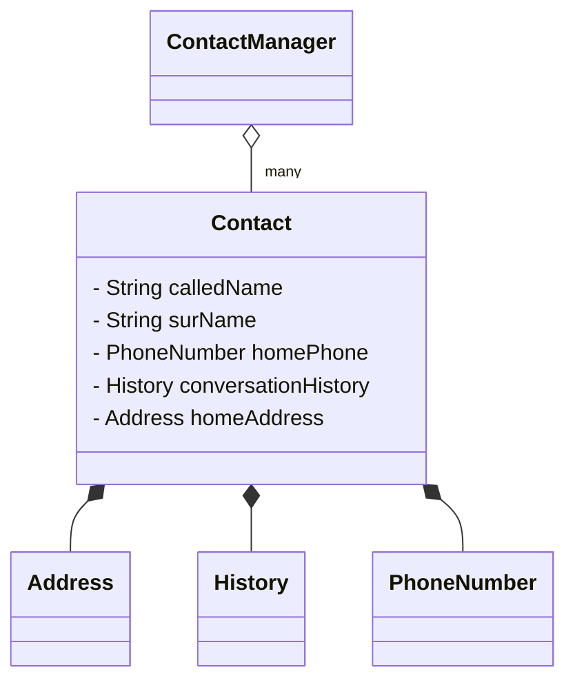

# Aggregate Objects

The concept of **aggregation** is as important as [abstraction](/ooDesign/polymorphism) in the skillful use of Object-Oriented programming. Aggregation is effected by composing classes by using other classes as composite parts. In the same way that a motor vehicle is an aggregate of doors, windows, motor, tires, seats, etc, a class can be an aggregate of other classes.

Creating classes as aggregations permits the programmer to take advantage of previously tested functionality without doing any additional coding.

Consider the design of an application for managing contacts. The main contact manager program would contain some kind of a collection of contacts. Aggregation is present anytime a collection is used as an instance variable.  The `Contact` class would also likely be an aggregate class. In the example below the `Contact` class contains an `Address`, a `PhoneNumber` and a `History` that are separate classes.  `Contact` also contains instance variables for the name of the contact.  

While `Address`, a `PhoneNumber` and  `History` are not detailed in the diagram, one can imagine that they would provide methods for adding data and retrieving data related to the class purpose. The programmer creating the contact list manager can use those methods to accomplish the goals of the contact manager, without the need to recreate that functionality.

The aggregation relationship can be described using the words **has-a**.   A `Contact` has-a `Address`.  A `Contact` has-a `History`.

#### Aggregation vs Composition

Some reference materials will distinguish between the ideas of *aggregation* and *composition*. For the purposes of this course the distinction is unimportant, but it is explained here to avoid confusion if you read other materials.

Composition is distinguished by being a relationship that persists. For example, a vehicle always has doors, seats, engine,etc. The vehicle would not continue to be a vehicle if the parts were not included.

Aggregation is also described as a **has-a** relationship, but it is a relationship that does not necessarily persist. A `Vehicle` has a `Passenger`, but is still a vehicle without the passenger. A `Room` has an `Occupant`.   

In both cases the relationship is represented in a class diagram using the diamond arrowhead.  If the arrowhead is filled in, it represents composition. If the arrowhead is hollow, it represents aggregation.

