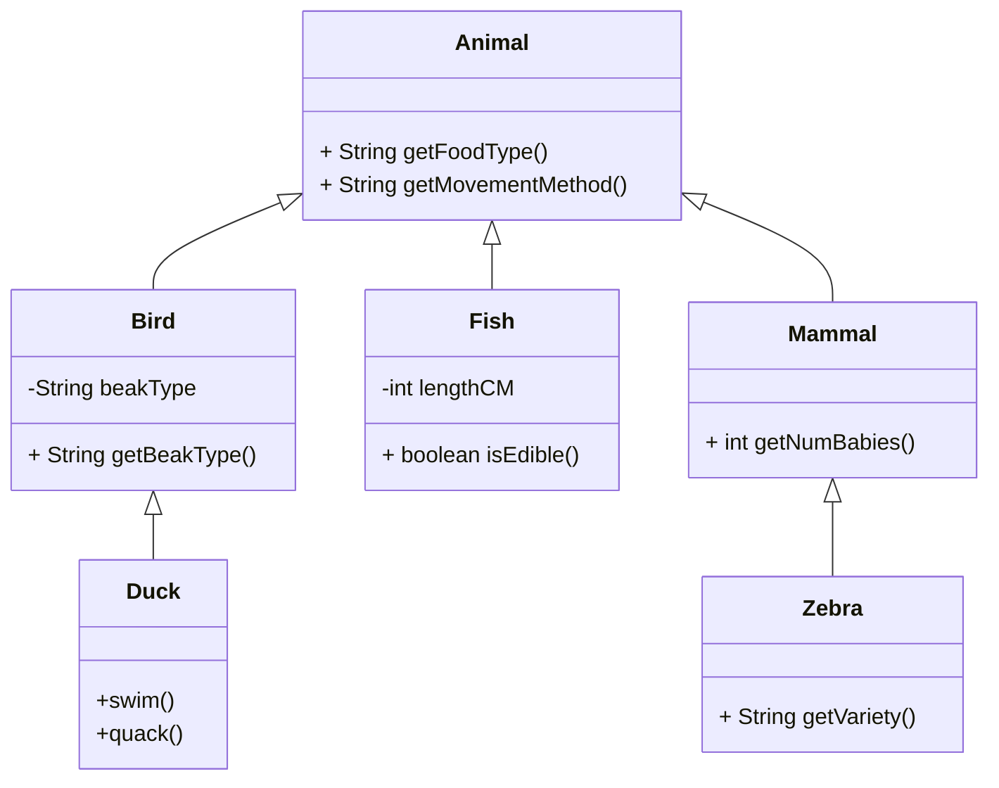

# Polymorphism via Inheritance

## Code Reuse
- **Code reuse** is one of the main advantages of OO programming. One mechanism for reusing code is to allow classes to automatically use the code written for another class via the mechanism of *inheritance*  

- Classes can be organized in a hierarchical relationship which automatically gives classes lower in the hierarchy access to all of the methods of the class higher in the tree. This is accomplished without any duplication of code.

- The subclass also automatically has **all of the instance and class variables** but, because those variables should be private, the subclass accesses those variables through getters and setters. This is one of the reasons why getters and setters are often `package private` or `protected` instead of `private`.

In the example shown below the class `Mammal` is a subclass of the class `Animal` and the class `Zebra` is a subclass of the class `Mammal`.  Because `Zebra` is also a `Mammal` and is also an `Animal`, any instance of the `Zebra` class will have methods called `getFoodType` and `getMovementMethod` as well as `getNumBabies`.  Of course `Zebra` also has the `getVariety` method that is defined in the `Zebra` class.    The diagram below is known as a **Class Diagram**.  



## When to use inheritance

- Creating a subclass is a good idea when the objects in your program already have a hierarchical relationship in "real life".  
   - For example: The concept of a Vehicle is a general concept.  The concept of a *Car* is a type of vehicle. The concept of a *Truck* is also a type of vehicle. That is a natural hierarchical relationship that could be represented in an OO program.
- A subclass must demonstrate an "is a"  or "is a kind of" relationship with its super class
- This type of relationship is often referred to as **abstraction**.


> Inheritance is often overused! Inheritance is the correct tool only when the two types share an “IS-A” Relationship 
>  - A `Dog` IS-A `Mammal`
>  - A `Car` IS-A `Vehicle`
>  - A `Square` IS-A `Shape`
{.is-warning}


## Creating A Subclass

The process of creating a subclass is fairly simple.  
The java `Integer` class cannot be subclassed because it is final, but the code below shows an imaginary subclass of the `Integer` called `RomanInteger` which provides conversion to and from roman numerals to integers. 

The `extends` keyword tells us that the class we are defining is a subclass.  The `RomanInteger` class would still have all of the same methods found in the java `Integer` class as well as the additional constructor and method shown in this code.

```java
public class RomanInteger extends Integer {
    public RomanInteger(int value) {
        super(value);
    }

    public RomanInteger(String romanNumeral) {
            // Implementation of converting Roman numeral to integer goes here
        // You can use your preferred algorithm to implement this conversion
        // and send the integer value to the super constructor.
        super(result);
    }

    public String toRoman() {

        // Implementation of converting integer to Roman numeral goes here
        // You can use your preferred algorithm to implement this conversion
        // and return the corresponding Roman numeral as a string.

        return(romanNumeralString);
    }

}
```


Or,for example, suppose that you needed a class that could return the middle value of a list.   Rather than writing your own list class, you could subclass one of the built in classes (`ArrayList` or `LinkedList` for example).  This class would be declared as shown below.

```java
public class MiddleList<E> extends java.util.ArrayList {

}
```
The **extends** keyword tells Java that the class being defined is a subclass of the class noted after the word **extends**.   The `<E>` notation is how parametarized classes are defined so that they can contain other objects.

We're adding a new method to this subclass.  That is done by simply writing the method.

```java
public class MiddleList<E> extends java.util.ArrayList {

public E getMiddleElement(){
  int middleLocation = (int) size()/2;
	return get(middleLocation);
}

}
```
Because this method is for a class that is a subclass of `ArrayList` we can call the methods from the `ArrayList` class as if they belonged to this class.  So we can call `size()` and `get()` without defining them.

We can now use our new class `MiddleList`.   It works just like an `ArrayList` but has one extra method.

```java
MiddleList<String> myList = new MiddleList<String>();
myList.add("frog");
myList.add("dog");
myList.add("cat");
myList.add("bird");
String middleElement = myList.getMiddleElement()
System.out.println(middleElement);
```
The code shown above will print the word `cat`.  Because the java `ArrayList<>` class is not `final` the above code will work.


## Method Overriding
We often want the behaviour of a subclass to be slightly different than the behaviour of a super class.  Method overriding helps you specialize methods in derived classes. This is a key part of inheritance.

Lets suppose that we want our new `MiddleList` class to insert new elements at the beginning of the list rather than append to the end of the list.  Appending is the default behaviour for `ArrayList`.   We can accomplish this by **overriding** the `add()` method.

Note that when you override a method the parameters and the return type must be identical to the method in the superclass.  A quick look at the [javadocs for `ArrayList`](http://localhost:8000/docs/api/java.base/java/util/ArrayList.html) shows that the signature for `add` is as follows: `boolean 	add​(E e)`.
We can take advantage of the `ArrayList` method that inserts an element at a specified location  (`void 	add(int index, E element)`) to accomplish our goal however we'll need to do something about a return value because the add at location method is void and we're writing a method that must return a boolean.


```java
public class MiddleList<E> extends java.util.ArrayList {

  public E getMiddleElement(){
    int middleLocation = (int) size()/2;
    return get(middleLocation);
  }

  @Override
  public boolean add(E toAdd) {
    add(0,toAdd); //insert at position zero
    return true; //this should be more sophisticated and check to ensure the element was inserted
  }    
}
```
Note the use of the **@Override** tag in the code to let the Java compiler know that we intend the add method to override the base class method.  Using the Override tag lets the compiler help us debug if we don't override the method properly.

After we override the `add()` method, the code that created a MiddleList to hold strings will return the word **dog** instead of **cat**.

```java
MiddleList<String> myList = new MiddleList<String>();
myList.add("frog");
myList.add("dog");
myList.add("cat");
myList.add("bird");
String middleElement = myList.getMiddleElement()
System.out.println(middleElement);
```

> An overridden method must have  exactly the same signature as the method in the base class.  The **type returned may not be changed** when overriding a method
> The exception to this rule: if a class type is returned (Vehicle), then the returned type may be changed to that of any descendent class of the returned type (Car).  This is known as a *covariant return type*
{.is-info}

The access permission of an overridden method can be changed to a  **more permissive access**) in the derived class (e.g. can go from `protected` to `public`).  However, the access permission of an overridden method can not be changed  to a **more restricted access** permission in the derived class (e.g. cannot go from `public` to `private`).  You can override and be MORE accessible but not less.


### Abstract Classes

Sometimes the requirements of a program suggest a fairly complex inheritance hierarchy.  Often the root class of that hierarchy is very general and wouldn't have much functionality on its own, but it is important to allow the relationships between other classes.  

The `Vehicle`, `Car`, `Truck` hierarchy has this characteristc.  A vehicle is a generic label with no distinguishing characteristics other than as a general term that allows us to relate Cars and Trucks to each other.

Java allows us to create such general classes through the use of **abstract** classes. If a class is declared to be abstract, a program is prevented from creating instances of that type.

A class can be declared to be abstract explicitly, e.g.
`public abstract class Vehicle{}`.  It also can be inferred to be abstract by including a method that is declared to be abstract, e.g. `public abstract int getNumThings()`. If a class has even one abstract method, the compiler will insist that the class declaration include the word `abstract`.

Abstract classes are used only as the base class for a subclass.   A partial definition for an abstract `Vehicle` class is shown below.  There are abstract methods as well as methods that are complete.   Note that the abstract methods are defined with a header, but no implementation is given.

```java
public abstract class Vehicle {
    private String identNumber;
    
    protected  void setVIN (String vin){
    			identNumber = vin;
    }
    protected  String getVIN(){
    			return identNumber;
    }
    public abstract String nextMaintenance();
  
    public void horn(){
        System.out.println("Beep beep");
    }
}
```
A subclass of this class must implement all of the abstract methods.  It should not copy the methods already implemented unless they are to be overridden. 


```java
public class Car extends Vehicle {
    public  String nextMaintenance(){
    			return ("next maintenance on Thursday");
    }
}
```

An abstract class can have any number of abstract and/or fully defined methods. If a subclass class of an abstract class does not define all of the abstract methods, then it is abstract also, and must add `abstract` to its modifier.  A class that has no abstract methods is called a concrete class


