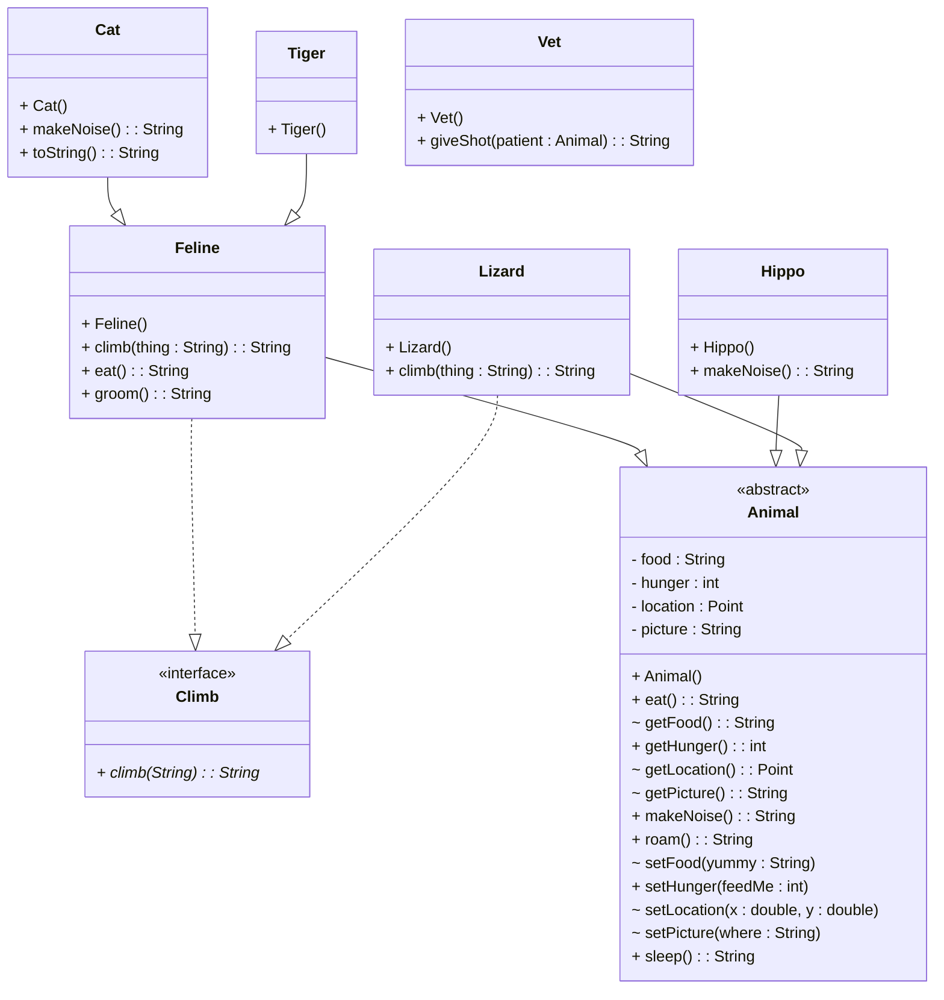

# Taking advantage of Polymorphism

A key advantage of polymorphism is the ability to create classes that operate on an abstraction so that the classes can be reused for many types. Consider the example shown in the class diagram.



The most general class is `Animal` and it is an abstract class.   `Hippo` and `Lizard` are derived directly from `Animal` but `Tiger` and `Cat` are subclasses of a separate  class: `Feline`. `Feline` and `Lizard` both implement an interface called `Climb`. This class hierarchy allows use to explore the advantages of designing classes to be polymorphic.


One of the most common applications of polymorphism is in the use of collections. Because all of the concrete classes are subclasses of `Animal`, we can define a collection to contain objects of type `Animal` and add any subclass object to it.  

```java
        Feline feline = new Feline();
        Hippo hippo = new Hippo();
        Cat cat = new Cat();
        Lizard lizard = new Lizard();
        ArrayList<Animal> theList = new ArrayList<>();
        theList.add(cat);
        theList.add(hippo);
        theList.add(lizard);
        theList.add(feline);

        for(Animal a: theList){
            System.out.println(a.eat());
        }
```
The code shown will work because the `eat()` method is declared in the superclass (`Animal`) so the compiler is confident that every object will have an `eat()` method. Each object will call the `eat()` method specific to its class.   
So, given the definitions of `eat()` shown below for `Animal`,`Feline` and `Lizard` (`Cat` and `Hippo` don't overide `Animal`) the output from this code will be 
```
Mousies what I love to eat Crunchies!!!!
My, that was a yummy mango
Crickets! 
Mousies what I love to eat Crunchies!!!!
```
**Feline eat()**
```
    @Override
    public String eat(){
        return ("Mousies what I love to eat " );
    }
```
**Lizard eat()**
```java
@Override
    public String eat(){
        return ("Crickets! " );
    }
```
**Animal eat()**
```java
    public  String eat(){
        return ("My, that was a yummy mango");
    }
```

The polymorphic calls to the correct method implementation are possible because Java binds the object to the function pointers representing the methods at runtime when the object is created. This is often referred to as **dynamic binding**.

Another extremely useful application for polymorphic types is method parameters. When you are writing methods it is adviseable to use the most abstract type possible for method parameters.  Consider the implementation of the `Vet` class shown below.

```java
public class Vet{ 
  public String giveShot(Animal patient){
    return ("This won't hurt a bit\n"+ patient.makeNoise());
  }
}
```
The method `giveShot()` has been designed to take an `Animal` parameter, which is the most abstract class available in the class hierarchy for this example.   This means that the `Vet` can give a shot to any type of animal and makes the code shown below possible.

```java
        Vet drJ = new Vet();
        System.out.println(drJ.giveShot(cat));
        System.out.println(drJ.giveShot(hippo));
        System.out.println(drJ.giveShot(lizard));
```
The output from the code will be as shown below. The `Animal` class provides an implementation of `makeNoise()` that is used in the event that the subclass does not override the method.
```
This won't hurt a bit
MEOW
This won't hurt a bit
Thump
This won't hurt a bit
Boo!
```
Again, each object knows exactly which implementation of `makeNoise()` to call because of dynamic binding.


