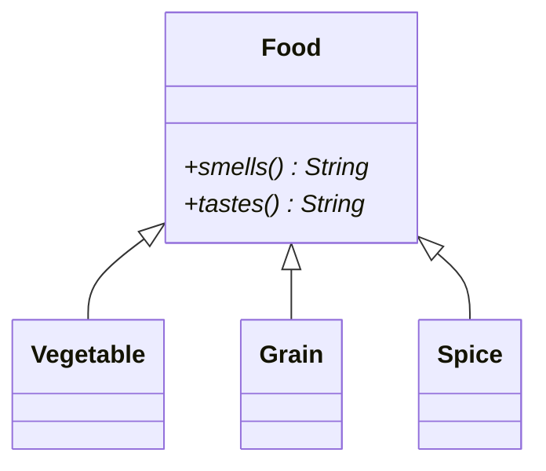
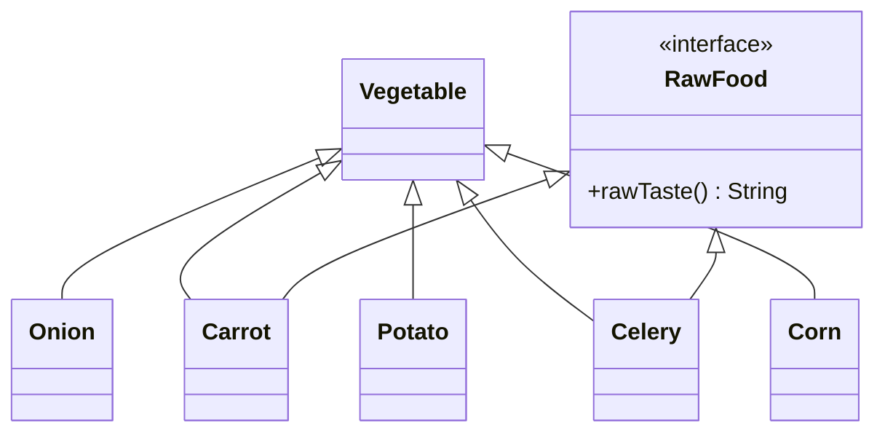
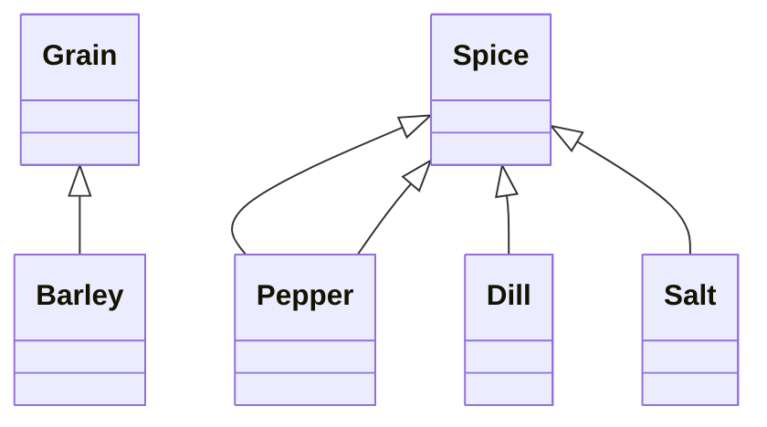

# Memory and References
# Practice Activities for [Programming with Polymorphism](/ooDesign/usingPolymorphism)

### Self Study Questions

1. What is a key advantage of polymorphism?

click here for one possible answer

  
Having the ability to create classes that operate on an abstraction.

2. What is one of the most common applications of polymorphism?

click here for one possible answer

  
**Collections.**

3. What is the term for when Java binds an object to the function pointers representing the methods at runtime when the object is created? 

click here for one possible answer

  
**Dynamic Binding.**

### Practice Problem

Implement the classes shown in the class diagram below.  The diagram has been broken up into small diagrams for ease of viewing.  There are many classes but they are each very small.
Write an additional class called `VegetableSoup` that contains an `ArrayList<Food>` called `ingredients`.   Create a method of `VegetableSoup` called `addToSoup(Food toAdd)`.   Create two additional methods in `VegetableSoup` called `smellTheSoup()` and `tasteTheSoup()`.  Each of these methods should return a string that contains the results of calling `smells()`, or `tastes()` on each of the ingredients.     Use the `Runner` class to instantiate objects, add them to the soup, and print out the smell and taste of the soup.  

Experiment with overriding `smells()` and `tastes()` in some classes but not other classes.  

A solution to this practice problem can be found on your docker container at `/course/practiceProblems/ooDesign/vegetableSoup`