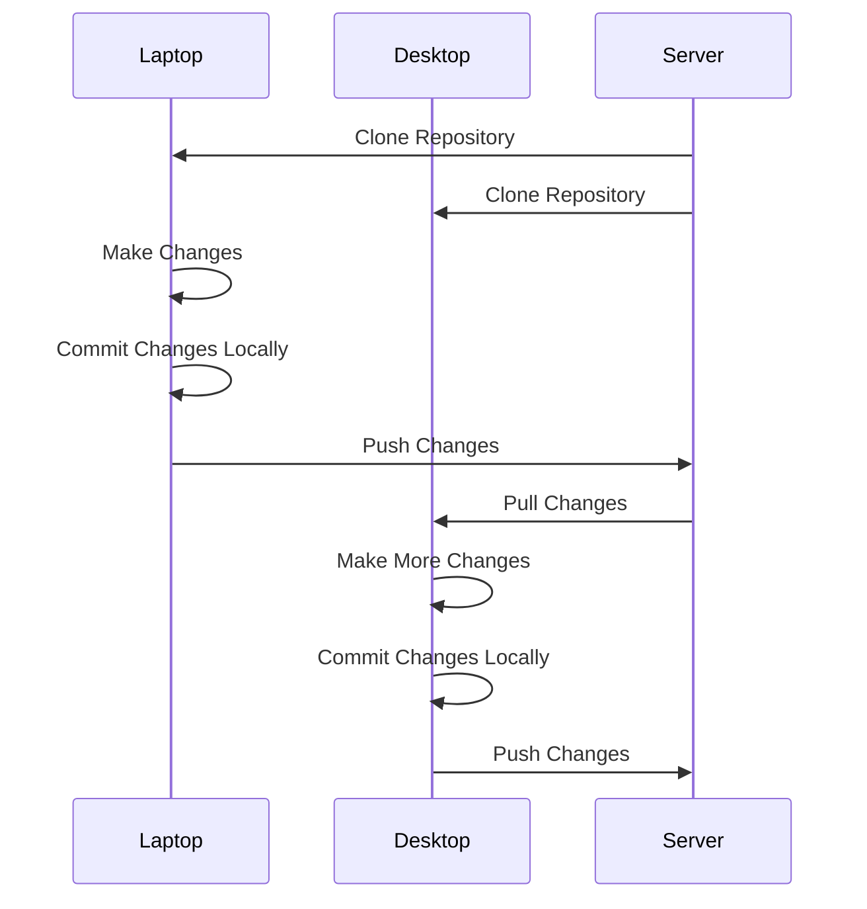

# Git

Git is a version control system that is used widely in the computing industry.  It allows multiple developers to work in the same codebase without causing problems for each other by editing the same part of the code at the same time.  

Git can be thought of as cloud storage that is specialized for working with programming projects.  It is much more than just that, but the cloud storage mental model is a good way to start out with git.

It takes much practice to become an expert git user, but it is easy to use git effectively with only a few commands.   The commands you will likely need most often are:

- git clone
   - makes a brand new copy of the repo from the server
- git add [filename(s)]
   - adds the files to your local instance
- git commit
   - adds a ‘commit tag’ to the current state of all the files so that you can easily get back to your current state
- git push
   - uploads all the states including your most recent commit to the server
   - does not upload uncommitted work
- git pull
   - gets the most recent state on the server and merges it into your local instance
- git status
   - tells you which files are not added, which are not committed  etc
- git rm
   - removes something from the git store (not from the drive)

The diagram below shows a common workflow for a person using more than one computer to work on a coding project.

